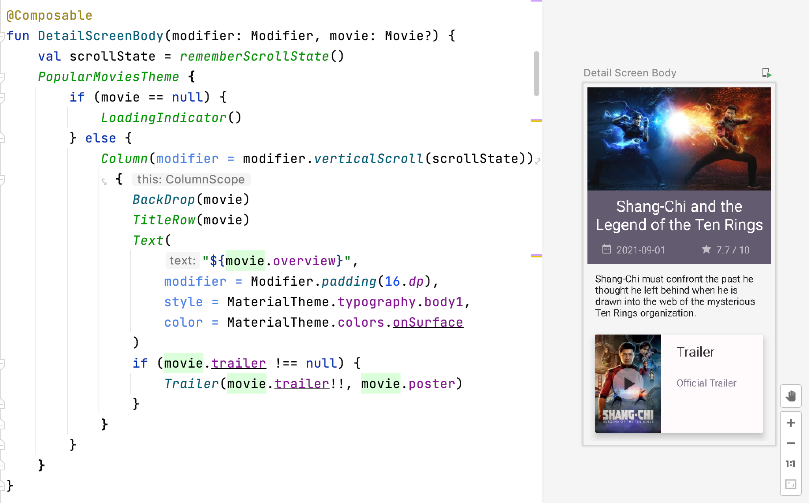

# PopularMovies2.0

:gear: **_work in progress_** 

:point_right: Please note that this is not a commercial app, this code is shared here for learning and technology demonstration purposes only.

New version of my Android app that shows you popular movies using themoviedb.org API.

The first version [Popular Movies](https://github.com/GemmaLaraSavill/PopularMovies#readme), I developed as part of my Android Developer Nanodegree at Udacity back in 2016. 

So much has changed in Android development since then, so I decided to make a new one with all the [Modern Android Development](https://developer.android.com/series/mad-skills) "MAD" :wink: skills.

This app communicates with the Internet to get movie data from the themoviedb.org API. 
When offline the data is provided from a local cache of data using an internal Room database.

Main changes from the 2016 version:

- programming language now Kotlin instead of Java
- SQL database now using Room
- UI now using Jetpack Compose instead of XML layouts
- still using threaded programming to take the load off the UI, but now using Kotlin coroutines and Flow instead of AsyncTask
- now using dependency injection with Hilt
- MVVM architecture
- Tests using AndroidJUnit4 and Okhttp3 MockWebServer
- Working on more features, comming soon...

Screenshot of one the Composables in the app in Android Studio Preview mode:

## Installation

1. Clone the code and import it as a project into [Android Studio](https://developer.android.com/studio)

2. Go to the [themoviedb.org](http://themoviedb.org) and request an API key. 

3. Once you have it open
_/app/src/main/java/com/gemma/popularmovies/data/network/ApiConstants.kt_ 
file and add your own API key in line 32
`const val API_KEY = ""`
